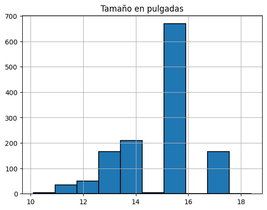
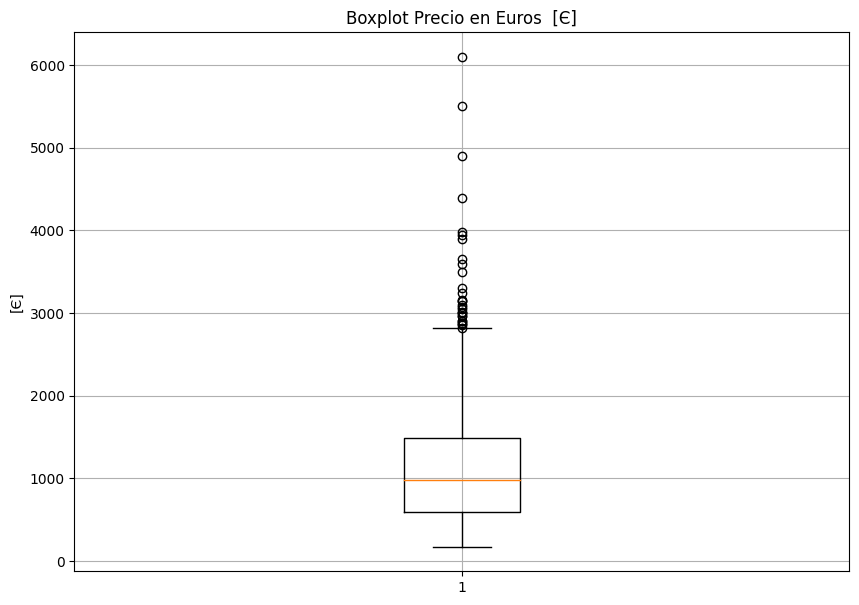

# Laptop Price Statistical Analysis

Jupyter-based statistical analysis of laptop prices and technical characteristics using descriptive statistics, visualization, regression and probability methods.

  

> A compact analysis workflow for understanding price drivers and evaluating laptop value through statistical exploration.

## Research question

How can laptop value be explored by combining technical characteristics, descriptive statistics, visual analysis, regression and probability?

~~~mermaid
flowchart LR
 A[laptop_price.csv] --> B[Exploratory analysis]
 B --> C[Regression models]
 B --> D[Probability analysis]
 C --> E[Interpretation]
 D --> E
~~~

## Selected visual results

These figures are extracted from outputs already embedded in the exploratory notebook.

## Notebooks and methods

| Notebook | Focus |
|---|---|
| [01_exploratory_analysis.ipynb](notebooks/01_exploratory_analysis.ipynb) | Inspection, descriptive statistics and visual exploration |
| [02_regression_models.ipynb](notebooks/02_regression_models.ipynb) | Linear and non-linear regression experiments |
| [03_probability_analysis.ipynb](notebooks/03_probability_analysis.ipynb) | Probability and distribution analysis |
| [supplement_probability_distributions.ipynb](notebooks/supplement_probability_distributions.ipynb) | Supplementary distributions |

The notebooks cover histograms, scatter plots, box plots, categorical comparisons, correlation analysis, regression and probability distributions. The report is [docs/laptop_price_analysis_report.pdf](docs/laptop_price_analysis_report.pdf).

## Stack

Python · Jupyter/Google Colab · pandas · NumPy · Matplotlib · Seaborn · SciPy · scikit-learn · statsmodels.

## Reproduce locally

~~~bash
python -m venv .venv
source .venv/bin/activate
pip install -r requirements.txt
~~~

Place the dataset at data/laptop_price.csv and run the notebooks in the order above. The dataset is not included in the repository, so exact outputs cannot be regenerated from a clone alone.

## Verified scope and limitations

Verified: four notebooks, exploratory/descriptive analysis, visualizations, correlation analysis, regression experiments and probability analysis. Not asserted: dataset size, final regression metrics or a single best laptop, because they are not published as a stable result artifact.

## Related case study

[Read the technical case study](https://andres-obando-portfolio-static.onrender.com/case-studies/laptop-price-statistical-analysis/)

## Author

**Andrés Obando** · [GitHub](https://github.com/cito515432) · [LinkedIn](https://www.linkedin.com/in/andres-obando-08095b203) · [Portfolio](https://andres-obando-portfolio-static.onrender.com/)
